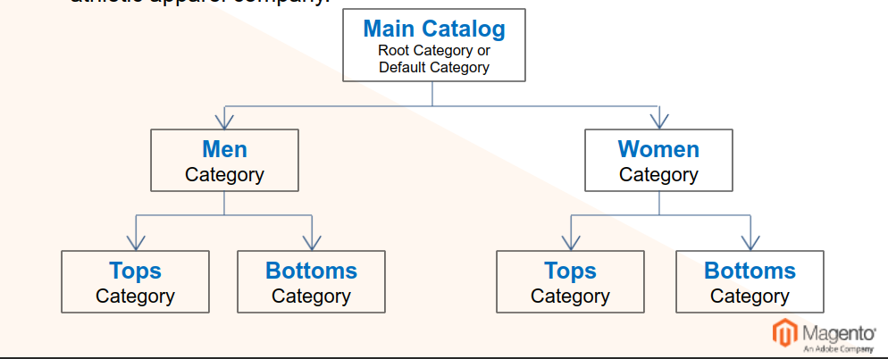

# Categories

## Category structure

The category structure is lika an upside-down tree, with the root at the top.
For example, here is category structure of Luma, our yoga-inspired athletic apparel company.

Categories in Magento are managed in *Catalog > Categories*  
Root categories are *"container"* categories that are associated with a particular store within a website.  
Subcategories are children of root categories, and can be displayed to the customer as part of the navigation menu.  
Category landing pages display content in one of three ways:  
- Products only
- Promotional material only
- Both at once
